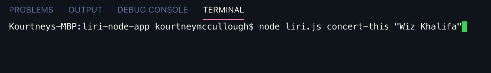
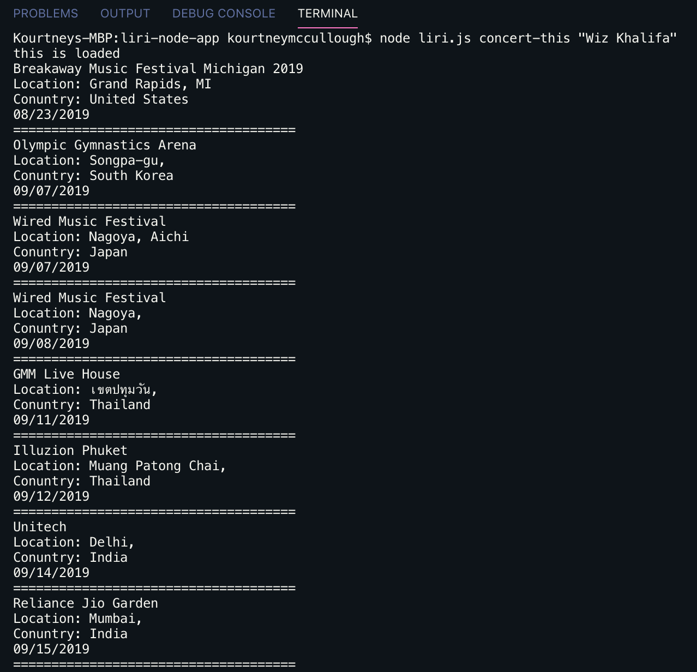
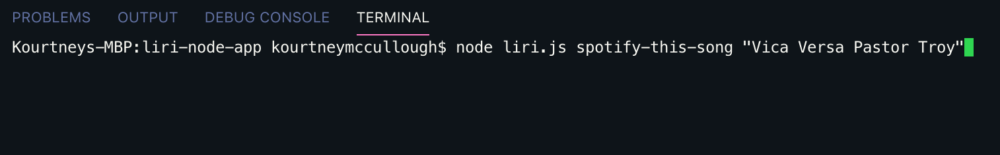
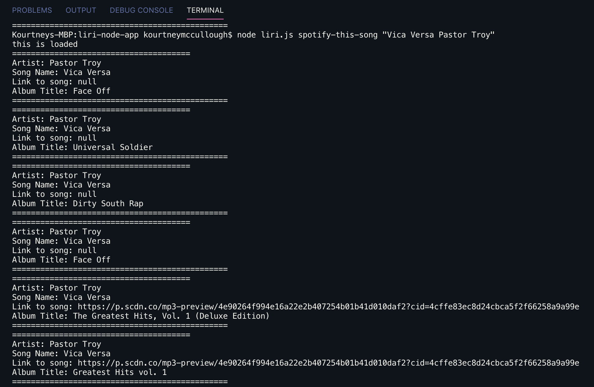
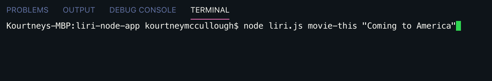
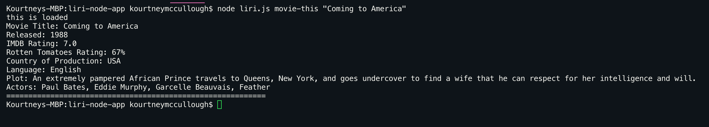
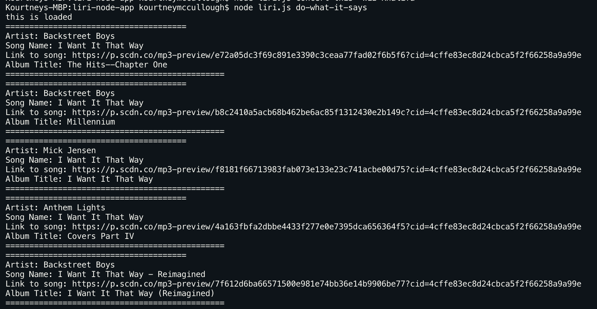

# liri-node-app

LIRI is like iPhone's SIRI. However, while SIRI is a Speech Interpretation and Recognition Interface, LIRI is a Language Interpretation and Recognition Interface. LIRI will be a command line node app that takes in parameters and gives you back data.

**Click to see full demonstration of**
[LIRI](https://drive.google.com/file/d/104Hjgvrs2w-v0ywkpxxinpQ5eXfd1bMz/view "LIRI App Demo")

# What does LIRI do?

**LIRI** will search Spotify for songs, Bands in Town for concerts, and OMDB for movies.

## Technologies used

Data to power LIRI is retrieved by sending requests using the axios and request package to the Bands in Town, Spotify and OMDB APIs.

- Actors in the movie
- Node-Spotify-API
- Axios
- Moment
- DotEnv
- Request
- OMDB API
- Bands In Town API

## concert-this

Allows users to the Bands in Town Artist Events API for an artist and render the following information about each event to the terminal:

- Name of the venue
- Venue location
- Date of the Event (use moment to format this as "MM/DD/YYYY")

example: liri.js concert-this "Wiz Khalifa"

**axios** npm package is used to request data from **bandsintown** api.

## spotify-this-song

Allows users to enter favorite song titles and musician names in order to render music information. The following information about the song in your terminal/bash window:

- Bands In Town API
- Artist(s)
- The song's name
- A preview link of the song from Spotify
- The album that the song is from

**example:** node liri.js spotify-this-song "Smooth Operator Sade"

If no song is provided then LIRI will default to "The Sign" by Ace of Base.

The node-spotify-api package is used in order to retrieve song information from the Spotify API.

**Node Spotify API** package is used to request data from spotify using secret credentials.

## movie-this

Allows users to enter movie name in order to render movie details.

**example** node liri.js movie-this 'Coming to America'

This will output the following information to your terminal/bash window:

- Title of the movie.
- Year the movie came out.
- IMDB Rating of the movie.
- Rotten Tomatoes Rating of the movie.
- Country where the movie was produced.
- Language of the movie.
- Plot of the movie.
- Actors in the movie.

If the user doesn't type a movie in, the program will output data for the movie 'Mr. Nobody.'

If you haven't watched "Mr. Nobody," then you should: http://www.imdb.com/title/tt0485947/

It's on Netflix!

**Request** package is used to request data from OMDB API.

## do-what-it-says

Using the fs Node package, LIRI will take the text inside of random.txt and then use it to call one of LIRI's commands.

It should run spotify-this-song for "I Want it That Way," as follows the text in random.txt.

**Enter this:** node liri.js do-what-it-says

##Developer

Kourtney McCullough
